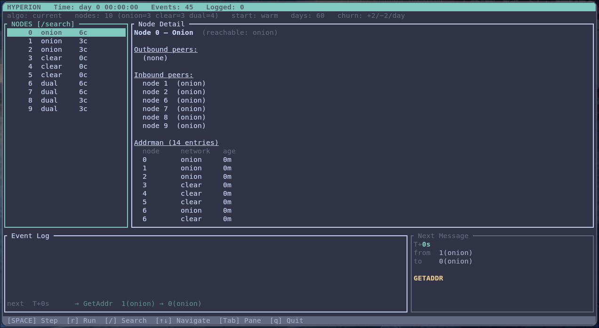

# Hyperion - the ADDR relay fork!

This is a fork of [Hyperion](https://github.com/sr-gi/hyperion), a Bitcoin P2P simulator originally built to study transaction propagation (Erlay). This fork studies address propagation instead; most of the original transaction code has been removed and replaced with address relay logic.

I heavily used Claude for the rewrite and I'm currently in the process of manually reviewing it, expect bugs and rough edges! :)

The simulator runs a Bitcoin network over days/weeks and measures two privacy/health metrics under different GETADDR cache timestamp algorithms:

1. **Fingerprinting**: can an observer link a node's clearnet identity to its onion identity? Dual-stack nodes answer GETADDR on both networks. If the cached `(address, timestamp)` pairs are identical across both, an observer who connects via clearnet and via Tor can determine they reached the same physical node, defeating the privacy benefit of Tor. You can read more about this attack on [Delving Bitcoin](https://delvingbitcoin.org/t/fingerprinting-nodes-via-addr-requests/1786)

2. **Staleness** — do departed nodes' addresses stay in addrmans longer than they should? Some algorithms send artificially fresher timestamps, which slows the natural aging-out of stale entries via `IsTerrible()`. One example of this behavior has been brought up [here](https://github.com/bitcoin/bitcoin/pull/33498#pullrequestreview-3319680730)


### Cache algorithms compared

| Name | Description |
|------|-------------|
| `current` | Bitcoin Core's current behaviour: cache entries keep their real `nTime` |
| `fixed-offset` | All cached timestamps are shifted back by a fixed amount |
| `network-based` | Timestamps are faked when the cache is served to a peer on a different network |

See [`doc/ADDRESS_RELAY_SPEC.md`](doc/ADDRESS_RELAY_SPEC.md) for full protocol details and Bitcoin Core source references.

## Build

```bash
cargo build
cargo run -- --help
```

## Usage

Use interactive mode to step through the simulation and inspect each node's addrman as it evolves. Keep the node count small so the event queue stays manageable:

```
cargo run -- -i --onion 3 --clearnet 3 --dual-stack 4
```



Complete list of flags:

```
  Usage: hyperion-addr [OPTIONS]

  Network topology:
        --onion <ONION>                       Onion-only nodes [default: 1000]
        --clearnet <CLEARNET>                 Clearnet-only nodes [default: 8000]
        --dual-stack <DUAL_STACK>             Dual-stack nodes [default: 1000]
        --reachable-clearnet-pct <PCT>        % of clearnet addresses accepting inbound [default: 15]
        --reachable-onion-pct <PCT>           % of onion addresses accepting inbound [default: 50]
        --outbounds <OUTBOUNDS>               Outbound connections per node [default: 8]

  Simulation:
        --days <DAYS>                         Days to simulate [default: 60]
        --joins-per-day <N>                   Nodes joining per day [default: 100]
        --leaves-per-day <N>                  Nodes leaving per day [default: 100]
        --start <MODE>                        Addrman init: warm | cold | peers | dns [default: warm]
        --burn-in <DAYS>                      Days to skip before recording stats (default: 30 for cold, 0 otherwise)
        --seed-sample-pct <PCT>               % of network addresses seeded into each addrman for --start dns [default: 1]
        --cache-algo <ALGO>                   current | fixed-offset | network-based [default: current]

  Output:
    -s, --seed <SEED>                         RNG seed for reproducibility
        --output-file <FILE>                  Write results to CSV file
        --log-level <LEVEL>                   info | debug | trace [default: info]
    -i, --interactive                         Launch interactive TUI
    -h, --help                                Print help
    -V, --version                             Print version
```

